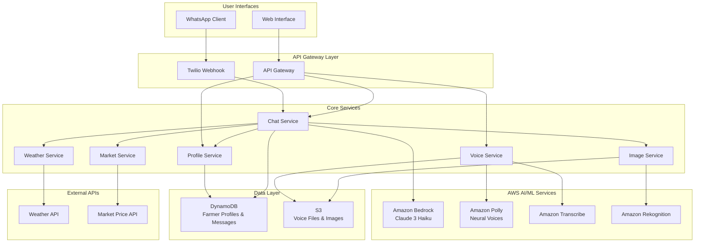

# Design Document: Voice Farming Assistant

## Overview

The Voice Farming Assistant is a serverless, cloud-native agricultural intelligence system built on AWS that provides voice-first farming advice to Indian farmers through WhatsApp integration. The system leverages AWS Bedrock's Claude 3 Haiku for agricultural reasoning, Amazon Polly for multi-language text-to-speech, and Twilio's WhatsApp Business API for seamless communication.

The architecture follows a microservices pattern with event-driven communication, ensuring scalability, reliability, and cost-effectiveness. The system supports 7 Indian languages plus English, processes voice messages, analyzes crop images, and provides personalized agricultural advice based on weather, market conditions, and farmer profiles.

## Architecture

### High-Level Architecture



### Service Architecture Pattern

The system follows a serverless microservices architecture where each service is implemented as AWS Lambda functions with specific responsibilities:

- **Stateless Services**: All services are stateless, storing data in DynamoDB
- **Event-Driven**: Services communicate through API Gateway and direct invocations
- **Auto-Scaling**: Lambda functions automatically scale based on demand
- **Cost-Optimized**: Pay-per-use model with optimized resource allocation

## Components and Interfaces

### 1. Chat Service (Core Orchestrator)

**Responsibility**: Central orchestrator that processes farmer queries and coordinates responses

**Interface**:
```typescript
interface ChatService {
  processMessage(request: ChatRequest): Promise<ChatResponse>
  getConversationHistory(farmerId: string): Promise<Message[]>
}

interface ChatRequest {
  farmerId: string
  message: string
  messageType: 'text' | 'voice' | 'image'
  language: SupportedLanguage
  metadata?: {
    location?: Coordinates
    cropType?: string
  }
}

interface ChatResponse {
  response: string
  audioUrl?: string
  confidence: number
  sources: string[]
  followUpQuestions?: string[]
}
```

**Key Functions**:
- Query classification and intent recognition
- Context management and conversation threading
- Response generation using Claude 3 Haiku
- Integration with specialized services (weather, market, image)

### 2. Voice Service

**Responsibility**: Handles voice message transcription and text-to-speech conversion

**Interface**:
```typescript
interface VoiceService {
  transcribeAudio(audioUrl: string, language: SupportedLanguage): Promise<TranscriptionResult>
  synthesizeSpeech(text: string, language: SupportedLanguage): Promise<AudioResult>
}

interface TranscriptionResult {
  text: string
  confidence: number
  language: SupportedLanguage
  duration: number
}

interface AudioResult {
  audioUrl: string
  duration: number
  format: 'mp3' | 'ogg'
}
```

**Implementation Details**:
- Uses Amazon Transcribe for speech-to-text with language detection
- Uses Amazon Polly Neural voices for natural-sounding speech synthesis
- Supports 7 Indian languages: Hindi, Tamil, Telugu, Kannada, Malayalam, Marathi, English
- Audio files stored in S3 with lifecycle policies for cost optimization

### 3. Profile Service

**Responsibility**: Manages farmer profiles, preferences, and interaction history

**Interface**:
```typescript
interface ProfileService {
  createProfile(profile: FarmerProfile): Promise<string>
  updateProfile(farmerId: string, updates: Partial<FarmerProfile>): Promise<void>
  getProfile(farmerId: string): Promise<FarmerProfile>
  recordInteraction(farmerId: string, interaction: Interaction): Promise<void>
}

interface FarmerProfile {
  farmerId: string
  phoneNumber: string
  name?: string
  location: Coordinates
  primaryCrops: string[]
  farmSize?: number
  language: SupportedLanguage
  preferences: {
    notificationTime: string
    weatherAlerts: boolean
    marketAlerts: boolean
  }
  createdAt: Date
  lastActive: Date
}
```

### 4. Weather Service

**Responsibility**: Provides weather data and agricultural recommendations

**Interface**:
```typescript
interface WeatherService {
  getCurrentWeather(location: Coordinates): Promise<WeatherData>
  getForecast(location: Coordinates, days: number): Promise<WeatherForecast[]>
  getAgricultureAdvice(weather: WeatherData, cropType: string): Promise<WeatherAdvice>
}

interface WeatherData {
  temperature: number
  humidity: number
  rainfall: number
  windSpeed: number
  soilMoisture?: number
  uvIndex: number
}

interface WeatherAdvice {
  irrigation: string
  pestControl: string
  harvesting: string
  planting: string
  urgentAlerts: string[]
}
```

### 5. Market Service

**Responsibility**: Provides crop pricing and market trend information

**Interface**:
```typescript
interface MarketService {
  getCurrentPrices(cropType: string, location: Coordinates): Promise<MarketPrice[]>
  getPriceTrends(cropType: string, days: number): Promise<PriceTrend[]>
  getOptimalSellingLocations(cropType: string, farmerLocation: Coordinates): Promise<MarketLocation[]>
}

interface MarketPrice {
  cropType: string
  price: number
  unit: string
  market: string
  date: Date
  quality: 'premium' | 'standard' | 'low'
}
```

### 6. Image Analysis Service

**Responsibility**: Analyzes crop images for pest and disease detection

**Interface**:
```typescript
interface ImageService {
  analyzeImage(imageUrl: string): Promise<ImageAnalysisResult>
  identifyPests(imageUrl: string): Promise<PestIdentification[]>
  identifyDiseases(imageUrl: string): Promise<DiseaseIdentification[]>
}

interface ImageAnalysisResult {
  pests: PestIdentification[]
  diseases: DiseaseIdentification[]
  nutritionalDeficiencies: NutrientDeficiency[]
  overallHealth: 'healthy' | 'moderate' | 'critical'
  confidence: number
}

interface PestIdentification {
  name: string
  confidence: number
  severity: 'low' | 'medium' | 'high'
  treatment: TreatmentRecommendation
}
```

### 7. WhatsApp Gateway

**Responsibility**: Handles WhatsApp message routing and media processing

**Interface**:
```typescript
interface WhatsAppGateway {
  sendMessage(to: string, message: string): Promise<void>
  sendVoiceMessage(to: string, audioUrl: string): Promise<void>
  processIncomingMessage(webhook: TwilioWebhook): Promise<void>
  downloadMedia(mediaUrl: string): Promise<string>
}
```

## Data Models

### Core Data Structures

```typescript
// Farmer Profile
interface FarmerProfile {
  farmerId: string              // Primary key
  phoneNumber: string           // WhatsApp number
  name?: string
  location: {
    latitude: number
    longitude: number
    district: string
    state: string
  }
  primaryCrops: string[]
  farmSize?: number             // in acres
  language: SupportedLanguage
  preferences: {
    notificationTime: string    // HH:MM format
    weatherAlerts: boolean
    marketAlerts: boolean
    voiceResponses: boolean
  }
  subscription: {
    plan: 'free' | 'premium'
    expiresAt?: Date
  }
  createdAt: Date
  lastActive: Date
  interactionCount: number
}

// Conversation Message
interface Message {
  messageId: string             // Primary key
  farmerId: string              // GSI partition key
  conversationId: string
  content: string
  messageType: 'text' | 'voice' | 'image'
  direction: 'inbound' | 'outbound'
  language: SupportedLanguage
  metadata: {
    audioUrl?: string
    imageUrl?: string
    transcriptionConfidence?: number
    processingTime: number
  }
  timestamp: Date
  status: 'pending' | 'processed' | 'failed'
}

// Agricultural Knowledge Base
interface KnowledgeEntry {
  entryId: string
  category: 'pest' | 'disease' | 'weather' | 'market' | 'general'
  cropTypes: string[]
  content: {
    problem: string
    symptoms: string[]
    treatment: string
    prevention: string
    timeline: string
    estimatedCost: number
  }
  language: SupportedLanguage
  sources: string[]
  lastUpdated: Date
}

// Supported Languages
type SupportedLanguage = 'hin' | 'tam' | 'tel' | 'kan' | 'mal' | 'mar' | 'eng'
```

### DynamoDB Table Design

**Table 1: FarmerProfiles**
- Partition Key: `farmerId`
- GSI: `phoneNumber-index` for WhatsApp number lookups
- TTL: Not applicable (permanent storage)

**Table 2: Messages**
- Partition Key: `messageId`
- Sort Key: `timestamp`
- GSI: `farmerId-timestamp-index` for conversation history
- TTL: 90 days for cost optimization

**Table 3: KnowledgeBase**
- Partition Key: `category`
- Sort Key: `entryId`
- GSI: `cropType-index` for crop-specific queries
- TTL: Not applicable (permanent storage)

## Correctness Properties

*A property is a characteristic or behavior that should hold true across all valid executions of a system—essentially, a formal statement about what the system should do. Properties serve as the bridge between human-readable specifications and machine-verifiable correctness guarantees.*

Before defining the correctness properties, let me analyze the acceptance criteria from the requirements to determine which are testable as properties:

<function_calls>
<invoke name="prework">
<parameter name="featureName">voice-farming-assistant

### Property Reflection

After analyzing all acceptance criteria, I identified several areas where properties can be consolidated to eliminate redundancy:

**Consolidation Areas:**
1. **Voice Processing Properties**: Properties 1.1, 1.2, and 2.2 all relate to voice message handling and can be combined into comprehensive voice processing properties
2. **Message Routing Properties**: Properties 2.1 and 2.3 both deal with message routing and can be consolidated
3. **Agricultural Advice Properties**: Properties 3.1, 3.2, 3.4, and 3.5 all relate to advice generation and can be streamlined
4. **Image Analysis Properties**: Properties 4.1, 4.2, 4.4 all relate to core image analysis functionality and can be combined
5. **Profile Management Properties**: Properties 5.2 and 5.3 both deal with profile data persistence and updates
6. **Market Data Properties**: Properties 6.1, 6.4, and 6.5 all relate to market data provision
7. **Weather Service Properties**: Properties 7.1, 7.2, 7.4, and 7.5 all relate to weather-based recommendations

The following properties provide unique validation value and will be retained as separate properties:
- Language support and detection (1.3, 1.4)
- Error handling (1.5, 4.5, 9.5)
- Conversation context (2.4, 2.5)
- Prioritization behaviors (4.3, 9.3)
- Proactive behaviors (5.4, 5.5, 6.3, 7.3)
- Interface parity and functionality (8.1, 8.2, 8.3, 8.4, 8.5)
- Performance requirements (9.1)
- Security and privacy (10.1, 10.3, 10.5)

### Correctness Properties

Based on the prework analysis and property reflection, here are the consolidated correctness properties:

**Property 1: Voice Message Processing**
*For any* voice message in a supported language, the system should transcribe it accurately, generate relevant agricultural advice, and convert the response to speech in the farmer's preferred language
**Validates: Requirements 1.1, 1.2, 2.2**

**Property 2: Multi-Language Support**
*For any* message in Hindi, Tamil, Telugu, Kannada, Malayalam, Marathi, or English, the system should process and respond appropriately in the same language
**Validates: Requirements 1.3**

**Property 3: Language Detection and Switching**
*For any* conversation where a farmer switches languages mid-conversation, the system should detect the language change and respond in the new language
**Validates: Requirements 1.4**

**Property 4: Voice Transcription Error Handling**
*For any* voice message that fails transcription, the system should request the farmer to repeat their message or switch to text input
**Validates: Requirements 1.5**

**Property 5: Message Routing**
*For any* message sent to the WhatsApp number (text, voice, or image), the system should route it to the appropriate processing service
**Validates: Requirements 2.1, 2.3**

**Property 6: Conversation Context Maintenance**
*For any* farmer's conversation, the system should maintain message threading and conversation context across all interactions
**Validates: Requirements 2.4**

**Property 7: Message Queuing During Downtime**
*For any* system downtime period, all incoming messages should be queued and processed when service resumes
**Validates: Requirements 2.5**

**Property 8: Agricultural Advice Generation**
*For any* farming query, the system should provide specific advice that includes scientific reasoning, reliable sources, and when applicable, safety warnings for chemical treatments
**Validates: Requirements 3.1, 3.2, 3.4, 3.5**

**Property 9: Weather-Based Recommendations**
*For any* weather-related query, the system should provide location-aware recommendations for the next 7 days
**Validates: Requirements 3.3**

**Property 10: Image Analysis and Treatment Recommendations**
*For any* crop image uploaded, the system should identify issues, provide confidence scores, and recommend specific treatments for each identified problem
**Validates: Requirements 4.1, 4.2, 4.4**

**Property 11: Image Analysis Prioritization**
*For any* crop image with multiple detected issues, the system should prioritize them by severity and urgency
**Validates: Requirements 4.3**

**Property 12: Image Quality Error Handling**
*For any* crop image with insufficient quality for analysis, the system should request a clearer photo with guidance on proper image capture
**Validates: Requirements 4.5**

**Property 13: New Farmer Profile Creation**
*For any* new farmer's first interaction, the system should collect basic information including location, primary crops, and language preference
**Validates: Requirements 5.1**

**Property 14: Profile Data Persistence and Updates**
*For any* farmer interaction or profile update, the system should store the interaction history and reflect profile changes in subsequent advice
**Validates: Requirements 5.2, 5.3**

**Property 15: Seasonal Pattern Tracking**
*For any* farmer profile, the system should track seasonal patterns and remind farmers of important agricultural activities
**Validates: Requirements 5.4**

**Property 16: Proactive Engagement**
*For any* farmer who hasn't interacted for 30 days, the system should send proactive seasonal advice via WhatsApp
**Validates: Requirements 5.5**

**Property 17: Market Price Information**
*For any* market price request, the system should provide current rates for specified crops and location, with optimal selling location recommendations and fallback to recent data when current data is unavailable
**Validates: Requirements 6.1, 6.4, 6.5**

**Property 18: Price Trend Visualization**
*For any* market price query, the system should show price trends over the past 30 days with visual indicators
**Validates: Requirements 6.2**

**Property 19: Price Change Notifications**
*For any* significant price change (>10%), the system should notify subscribed farmers
**Validates: Requirements 6.3**

**Property 20: Weather-Based Agricultural Recommendations**
*For any* weather condition change, the system should provide proactive farming recommendations, integrate rainfall with irrigation advice, and recommend optimal timing for agricultural activities
**Validates: Requirements 7.1, 7.2, 7.4, 7.5**

**Property 21: Extreme Weather Alerts**
*For any* extreme weather forecast, the system should send urgent alerts with protective measures
**Validates: Requirements 7.3**

**Property 22: Web Interface Feature Parity**
*For any* functionality available through WhatsApp, the web interface should provide the same functionality in a mobile-first responsive design
**Validates: Requirements 8.1**

**Property 23: Web Interface Conversation Management**
*For any* farmer accessing the web interface, the system should display conversation history and allow seamless switching between voice and text
**Validates: Requirements 8.2**

**Property 24: Web Interface Visual Data Presentation**
*For any* web interface access, the system should show visual charts for weather trends, market prices, and crop calendars
**Validates: Requirements 8.3**

**Property 25: Web Interface Profile Management**
*For any* web interface user, the system should allow management of profile information and notification preferences
**Validates: Requirements 8.4**

**Property 26: Web Interface Image Upload**
*For any* image uploaded via web interface, the system should provide real-time analysis progress and results
**Validates: Requirements 8.5**

**Property 27: Response Time Performance**
*For any* farmer query, the system should respond within 10 seconds for text messages and 15 seconds for voice messages
**Validates: Requirements 9.1**

**Property 28: Query Prioritization Under Load**
*For any* high system load scenario, the system should prioritize emergency and time-sensitive queries
**Validates: Requirements 9.3**

**Property 29: Graceful Degradation**
*For any* component failure, the system should gracefully degrade and notify farmers of limited functionality
**Validates: Requirements 9.5**

**Property 30: Data Encryption**
*For any* farmer data handled by the system, it should be encrypted in transit and at rest using AWS security best practices
**Validates: Requirements 10.1**

**Property 31: Data Deletion**
*For any* farmer data deletion request, the system should remove all personal information within 30 days
**Validates: Requirements 10.3**

**Property 32: Data Transparency**
*For any* data collection scenario, the system should provide farmers with transparency about what data is collected and how it's used
**Validates: Requirements 10.5**

## Error Handling

### Error Categories and Strategies

**1. Voice Processing Errors**
- **Transcription Failures**: Fallback to text input request with user-friendly guidance
- **Audio Quality Issues**: Request re-recording with specific audio quality tips
- **Language Detection Errors**: Default to farmer's profile language with confirmation prompt

**2. External Service Failures**
- **Weather API Unavailable**: Use cached data with timestamp warnings
- **Market API Failures**: Provide historical data with clear disclaimers
- **Bedrock Service Limits**: Implement exponential backoff with user notification

**3. Data Consistency Errors**
- **Profile Corruption**: Graceful recovery with profile rebuild prompts
- **Message Threading Issues**: Maintain conversation context with fallback mechanisms
- **Image Analysis Failures**: Clear error messages with retry options

**4. Infrastructure Errors**
- **Lambda Timeouts**: Implement circuit breakers with user notifications
- **DynamoDB Throttling**: Exponential backoff with request queuing
- **S3 Upload Failures**: Retry mechanisms with progress indicators

### Error Response Patterns

```typescript
interface ErrorResponse {
  error: {
    code: string
    message: string
    userMessage: string  // Localized, farmer-friendly message
    retryable: boolean
    suggestedActions: string[]
  }
  fallbackData?: any
  timestamp: Date
}

// Example error responses
const VOICE_TRANSCRIPTION_ERROR: ErrorResponse = {
  error: {
    code: 'TRANSCRIPTION_FAILED',
    message: 'Audio transcription failed due to poor quality',
    userMessage: 'मुझे आपका संदेश समझने में कठिनाई हो रही है। कृपया फिर से बोलें या टेक्स्ट में लिखें।',
    retryable: true,
    suggestedActions: ['Speak clearly', 'Reduce background noise', 'Use text input']
  },
  timestamp: new Date()
}
```

## Testing Strategy

### Dual Testing Approach

The Voice Farming Assistant requires comprehensive testing using both unit tests and property-based tests to ensure reliability across diverse agricultural scenarios and user interactions.

**Unit Tests**: Focus on specific examples, edge cases, and integration points
- WhatsApp webhook processing with various message formats
- Voice transcription accuracy for different Indian accents
- Image analysis with known pest/disease samples
- Error handling for specific failure scenarios
- API integration with weather and market data services

**Property-Based Tests**: Verify universal properties across all inputs
- Voice processing works correctly for any supported language
- Agricultural advice generation maintains consistency across crop types
- Profile management preserves data integrity across all operations
- Message routing functions correctly for any message type
- Performance requirements are met under various load conditions

### Property-Based Testing Configuration

**Testing Framework**: Use Hypothesis (Python) or fast-check (TypeScript/JavaScript) for property-based testing
**Test Configuration**: Minimum 100 iterations per property test to ensure comprehensive coverage
**Test Tagging**: Each property test must reference its design document property

**Example Property Test Tags**:
- **Feature: voice-farming-assistant, Property 1: Voice Message Processing**
- **Feature: voice-farming-assistant, Property 8: Agricultural Advice Generation**
- **Feature: voice-farming-assistant, Property 17: Market Price Information**

### Test Data Strategy

**Synthetic Data Generation**:
- Generate diverse farmer profiles across different Indian states
- Create voice samples in all supported languages with various accents
- Generate crop images with different lighting, angles, and quality levels
- Simulate various weather conditions and market scenarios

**Real Data Integration**:
- Use anonymized historical farming data for validation
- Integrate with actual weather APIs for realistic testing
- Test with real WhatsApp message formats and media types

### Performance Testing

**Load Testing Scenarios**:
- Peak farming season traffic (monsoon, harvest periods)
- Simultaneous voice message processing across languages
- Concurrent image analysis requests
- High-frequency market price updates

**Performance Benchmarks**:
- Voice transcription: <5 seconds for 30-second audio clips
- Text-to-speech generation: <3 seconds for 200-word responses
- Image analysis: <10 seconds for 5MB crop images
- Database queries: <100ms for profile lookups
- End-to-end response: <10 seconds for text, <15 seconds for voice

### Integration Testing

**External Service Integration**:
- AWS Bedrock Claude 3 Haiku response quality and consistency
- Amazon Polly voice synthesis across all supported languages
- Twilio WhatsApp API message delivery and media handling
- Weather and market data API reliability and accuracy

**Cross-Service Communication**:
- Message flow from WhatsApp to final response delivery
- Profile updates propagating across all services
- Error handling and fallback mechanisms
- Data consistency across DynamoDB tables

This comprehensive testing strategy ensures the Voice Farming Assistant delivers reliable, accurate, and culturally appropriate agricultural advice to Indian farmers across diverse scenarios and usage patterns.